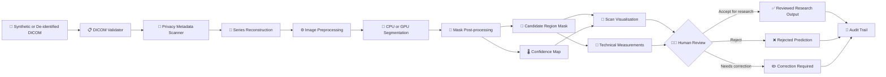
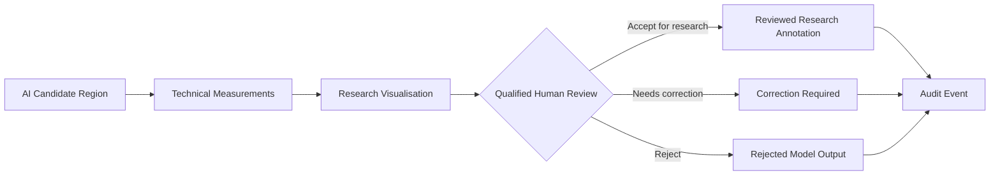

<div align="center">

# 🩻 MedVision Research Pipeline

### Research-Only Medical Imaging AI with DICOM, MONAI, PyTorch and GPU Inference

**Process synthetic or appropriately de-identified DICOM studies, reconstruct 3D medical volumes, run research segmentation, visualise candidate masks, calculate technical measurements, and route every result through human review.**

<br>

](https://github.com/sgt-Vision-Research-Pipeline/actions)
[](https://github.com/-Research-Pipeline/stargazers)
[](https://github.com/sgt-9304/Medpeline/forks)

</div>

---

## ⚠️ Intended Use and Medical Disclaimer

**MedVision Research Pipeline is an educational and research reference implementation.**

This repository:

- Is not a medical device
- Is not clinically validated
- Does not diagnose diseases or medical conditions
- Does not recommend medicines, dosages or treatments
- Does not replace radiologists, doctors or other qualified professionals
- Must not be used for patient triage, prognosis or direct patient care
- Must not be connected to a production clinical system without appropriate validation, governance and regulatory review

All generated masks, confidence values and measurements are **research outputs only** and require independent review by appropriately qualified professionals.

> **Do not upload real patient data, protected health information, clinical reports, hospital data or confidential medical images to this public repository.**

---

## 🖼️ Demo Preview

![Synthetic Dtation-demo.png

> ⚠️ **Synthetic research demonstration only:** The highlighted region was programmatically generated to demonstrate the image-processing and visualisation pipeline. It has no diagnostic, pathological or clinical meaning.

### What the demonstration shows

- 📥 Synthetic DICOM-series generation
- 🔍 DICOM metadata and image validation
- 🧱 Ordered 3D medical-volume reconstruction
- ⚙️ Intensity preprocessing and normalisation
- 🧠 CPU or GPU-capable segmentation inference
- 🎨 Axial, coronal and sagittal overlays
- 📏 Candidate-region measurements
- 👨‍⚕️ Mandatory human-review workflow
- 📜 Auditable technical results

---

## 💡 Why I Built This Project

Medical-imaging AI requires more than loading an image and running a neural network.

A dependable research workflow must consider:

- DICOM metadata and series ordering
- Image geometry and voxel spacing
- Patient-data privacy
- 3D preprocessing
- Model reproducibility
- GPU inference
- Segmentation visualisation
- Quantitative measurements
- Model limitations
- Qualified human review
- Auditability

MedVision demonstrates these engineering stages in one modular and reproducible repository.

The project deliberately uses **synthetic DICOM data** and a **deterministic demonstration segmenter** so developers can explore the complete architecture without exposing patient data or making unsupported clinical claims.

---

## ✨ Key Capabilities

### 📄 DICOM processing

- Reads DICOM files using `pydicom`
- Identifies files that contain pixel data
- Sorts slices using spatial image metadata
- Reconstructs DICOM slices into a 3D NumPy volume
- Reads pixel spacing and slice thickness
- Applies rescale slope and intercept
- Validates maximum file and series sizes
- Handles synthetic CT-style image series

### 🔐 Privacy metadata screening

- Checks common identifying DICOM fields
- Flags possible privacy concerns
- Supports creation of de-identified research copies
- Replaces common direct identifiers
- Generates replacement DICOM UIDs
- Marks patient identity as removed
- Avoids logging medical pixel data or identifying attributes

> Metadata replacement alone does not guarantee complete anonymisation. Identifying information can exist in private tags, filenames, burned-in pixels, free-text fields and surrounding systems.

### 🧠 Research segmentation

- Supports a safe deterministic demonstration segmenter
- Provides a TorchScript model adapter
- Supports CPU and CUDA device selection
- Supports automatic mixed precision during CUDA inference
- Produces a binary candidate-region mask
- Produces a confidence map
- Preserves input and output volume shapes

### 📊 Quantitative measurements

The pipeline calculates technical research measurements such as:

- Candidate-region voxel count
- Candidate-region volume in cubic millimetres
- Mean model confidence inside the candidate mask
- Inference latency
- Processing device
- Model mode
- Volume dimensions
- Voxel spacing

These measurements describe algorithm output only. They do not represent a diagnosis.

### 🎨 Medical-image visualisation

- Axial view
- Coronal view
- Sagittal view
- Segmentation-mask overlay
- Research warning on generated figures
- Downloadable PNG visualisation
- Original image and predicted-region comparison

### 👨‍⚕️ Human review

Every model result begins with:

```text
not_reviewed
```

A reviewer can record one of the following decisions:

```text
accept_for_research
reject
needs_correction
```

The review stores:

- Reviewer identity
- Review decision
- Reviewer comment
- Result identifier
- Audit timestamp

---

## 🏗️ System Architecture



---

## 🔄 Processing Pipeline

```text
Synthetic or Appropriately De-identified DICOM Study
                         ↓
                Safe Path Validation
                         ↓
                  DICOM File Loading
                         ↓
             Pixel and Metadata Validation
                         ↓
               Privacy Attribute Screening
                         ↓
                Spatial Slice Ordering
                         ↓
               3D Volume Reconstruction
                         ↓
              Intensity Transformation
                         ↓
                Volume Normalisation
                         ↓
               CPU or GPU Inference
                         ↓
            Candidate Segmentation Mask
                         ↓
              Confidence Map Generation
                         ↓
           Volume and Confidence Measurement
                         ↓
       Axial, Coronal and Sagittal Visualisation
                         ↓
                 Human Review Queue
                         ↓
                    Audit Event
```

---

## 🧠 Model Status

The default repository uses:

```text
MODEL_MODE=demo_threshold
```

This is a deterministic intensity-threshold demonstration model.

It demonstrates:

- DICOM-to-volume processing
- Model-input preparation
- Segmentation-mask generation
- Confidence-map handling
- Candidate-region measurement
- Medical-image overlay generation
- Result storage
- Human review
- Audit logging

It does **not** detect any disease or medical condition and has no clinical meaning.

### Current project status

- ✅ End-to-end DICOM pipeline implemented
- ✅ Synthetic DICOM generator included
- ✅ DICOM privacy scanner included
- ✅ CPU and CUDA detection included
- ✅ TorchScript inference adapter included
- ✅ Segmentation visualisation included
- ✅ Quantitative measurements included
- ✅ Mandatory review workflow included
- ✅ FastAPI endpoints included
- ✅ Docker configuration included
- ✅ Tests and GitHub Actions included
- ⚠️ No clinical model weights included
- ⚠️ No diagnostic capability
- ⚠️ No medication or treatment recommendation
- ⚠️ Research and educational use only

---

## 🛠️ Technology Stack

### Medical imaging

- `pydicom`
- `MONAI`
- `NumPy`
- DICOM
- 3D medical volumes

### AI and deep learning

- PyTorch
- TorchScript
- CUDA device detection
- Automatic mixed precision
- Research segmentation
- Confidence-map processing

### Visualisation

- Matplotlib
- Pillow
- Axial, coronal and sagittal overlays
- Candidate-mask visualisation

### Backend and APIs

- Python 3.12
- FastAPI
- Pydantic
- Uvicorn
- REST APIs

### Testing and delivery

- Pytest
- Ruff
- GitHub Actions
- Docker
- Docker Compose

---

## 📁 Project Structure

```text
MedVision-Research-Pipeline/
├── app/
│   ├── __init__.py
│   ├── api.py                   # FastAPI endpoints
│   ├── dicom_io.py              # DICOM loading and privacy scanning
│   ├── inference.py             # CPU/GPU inference engine
│   ├── measurements.py          # Region measurements
│   ├── pipeline.py              # End-to-end processing pipeline
│   ├── preprocess.py            # Image normalisation
│   ├── schemas.py               # API request models
│   ├── security.py              # Safe path validation
│   ├── settings.py              # Environment configuration
│   ├── store.py                 # Results and audit storage
│   ├── synthetic.py             # Synthetic DICOM generator
│   └── visualise.py             # Orthogonal view visualisation
│
├── assets/
│   ├── segmentation-demo.png    # Synthetic segmentation preview
│   └── social-preview.png       # GitHub social-preview image
│
├── docs/
│   ├── DATA_GOVERNANCE.md       # Privacy and governance guidance
│   └── MODEL_CARD.md            # Demonstration model card
│
├── models/
│   └── README.md                # Model integration instructions
│
├── outputs/
│   └── .gitkeep                 # Generated analysis outputs
│
├── sample_data/
│   └── dicom/
│       └── .gitkeep             # Generated synthetic DICOM files
│
├── tests/
│   ├── test_measurements.py
│   ├── test_preprocess.py
│   └── test_security.py
│
├── .github/
│   └── workflows/
│       └── ci.yml               # Automated CI workflow
│
├── .env.example
├── .gitignore
├── CONTRIBUTING.md
├── Dockerfile
├── LICENSE
├── README.md
├── SECURITY.md
├── docker-compose.yml
├── pyproject.toml
└── requirements.txt
```

---

## ⚡ Quick Start

### Prerequisites

Make sure you have:

- Python 3.12 or a compatible version
- Git
- `pip`
- Docker, optional
- NVIDIA CUDA-compatible environment, optional

### 1. Clone the repository

```bash
git clone https://github.com/sgt-9304/MedVision-Research-Pipeline.git
cd MedVision-Research-Pipeline
```

### 2. Create a virtual environment

```bash
python -m venv .venv
```

Activate it on Windows:

```bash
.venv\Scripts\activate
```

Activate it on Linux or macOS:

```bash
source .venv/bin/activate
```

### 3. Install the dependencies

```bash
pip install -r requirements.txt
```

PyTorch and MONAI are large dependencies, so the first installation may take several minutes.

### 4. Create the environment file

Windows:

```bash
copy .env.example .env
```

Linux, macOS or Git Bash:

```bash
cp .env.example .env
```

### 5. Generate a synthetic DICOM study

```bash
python -m app.synthetic --output sample_data/dicom
```

Expected output:

```text
{
  "output": "sample_data/dicom",
  "slices": 32,
  "note": "Synthetic data only"
}
```

### 6. Start the API

```bash
uvicorn app.api:app --reload
```

### 7. Open Swagger

```text
http://127.0.0.1:8000/docs
```

---

## 🐳 Run with Docker

Create your local environment file:

```bash
cp .env.example .env
```

Build and start:

```bash
docker compose up --build
```

Open:

```text
http://localhost:8000/docs
```

The Docker image automatically generates a synthetic DICOM study for demonstration.

---

## 🔌 API Endpoints

### Health check

```http
GET /health
```

Example response:

```json
{
  "status": "ok",
  "intended_use": "research_only"
}
```

### Validate a DICOM study

```http
POST /v1/dicom/validate
```

Request:

```json
{
  "dicom_directory": "sample_data/dicom"
}
```

Example response:

```json
{
  "valid": true,
  "slice_count": 32,
  "shape": [
    32,
    128,
    128
  ],
  "spacing_mm": [
    2.5,
    1.0,
    1.0
  ],
  "privacy_findings": [],
  "warning": "Metadata scanning does not guarantee complete de-identification."
}
```

### Run the analysis pipeline

```http
POST /v1/studies/analyse
```

Request:

```json
{
  "dicom_directory": "sample_data/dicom",
  "threshold": 0.65
}
```

Example response structure:

```json
{
  "study": {
    "series_count": 1,
    "slice_count": 32,
    "shape": [
      32,
      128,
      128
    ],
    "spacing_mm": [
      2.5,
      1.0,
      1.0
    ],
    "privacy_findings": []
  },
  "inference": {
    "device": "cpu",
    "model_mode": "demo_threshold",
    "latency_ms": 15.2
  },
  "candidate_region": {
    "voxel_count": 1200,
    "volume_mm3": 3000.0,
    "mean_confidence": 0.79
  },
  "result_id": "generated-result-id",
  "clinical_status": "not_reviewed",
  "warning": "Model-generated research output. Not a diagnosis or treatment recommendation."
}
```

The exact values depend on the generated synthetic study, runtime environment and threshold.

### Retrieve a result

```http
GET /v1/results/{result_id}
```

### View the generated overlay

```http
GET /v1/results/{result_id}/visualisation
```

This returns a PNG containing axial, coronal and sagittal research overlays.

### Record a human review

```http
POST /v1/reviews/{result_id}
```

Request:

```json
{
  "decision": "accept_for_research",
  "reviewer": "qualified-reviewer",
  "comment": "Synthetic demonstration output reviewed for research workflow validation."
}
```

Supported decisions:

```text
accept_for_research
reject
needs_correction
```

### View audit events

```http
GET /v1/audit
```

---

## ⚙️ Configuration

The `.env.example` file contains:

```env
DATA_ROOT=sample_data
OUTPUT_ROOT=outputs
MODEL_MODE=demo_threshold
MODEL_PATH=
DEVICE=auto
MAX_SLICES=1000
MAX_FILE_MB=50
```

### Force CPU inference

```env
DEVICE=cpu
```

### Automatically use CUDA when available

```env
DEVICE=auto
```

### Use a separately validated TorchScript model

```env
MODEL_MODE=torchscript
MODEL_PATH=models/research_model.pt
```

No model weights are included with this repository.

---

## 🧪 Add a Research Model

Only use a model when you have permission to distribute or use it.

Place it locally:

```text
models/research_model.pt
```

Update `.env`:

```env
MODEL_MODE=torchscript
MODEL_PATH=models/research_model.pt
```

The `.gitignore` prevents `.pt` and `.pth` model files from being committed accidentally.

Document the model in `models/README.md` with:

- Model name
- Architecture
- Version
- Source
- Licence
- Input format
- Output format
- Training-data provenance
- Intended use
- Excluded use
- Evaluation metrics
- Known limitations
- SHA-256 checksum
- Clinical-validation status

Do not claim clinical validation unless it has been appropriately established.

---

## 🔐 Privacy and Data Governance

Use only:

- Synthetic DICOM files
- Properly licensed public research datasets
- Appropriately de-identified images
- Data approved for the intended research purpose
- Data with documented provenance

Do not upload:

- Real patient images
- Patient names
- Medical-record numbers
- Birth dates
- Addresses
- Accession numbers
- Hospital identifiers
- Clinical reports
- Confidential medical information
- Cognizant or client data
- Proprietary model weights
- API credentials

### Potential identifying locations

Protected information may exist in:

- Standard DICOM metadata
- Private DICOM tags
- Free-text fields
- Filenames
- Folder names
- Burned-in image pixels
- Linked reports
- Image archives
- Application logs

The repository’s privacy scanner detects selected metadata attributes. It does not guarantee complete de-identification.

---

## 📊 Model Evaluation Guidance

A real research model should be evaluated using multiple metrics.

### Segmentation metrics

- Dice similarity coefficient
- Intersection over Union
- Hausdorff distance
- Average surface distance
- Sensitivity
- Specificity
- Precision
- Recall

### Operational metrics

- CPU inference latency
- GPU inference latency
- Peak GPU memory
- Throughput
- Failure rate
- Preprocessing time
- End-to-end processing time

### Validation analysis

- Independent test dataset
- Scanner-vendor analysis
- Imaging-protocol analysis
- Demographic subgroup analysis
- Image-quality analysis
- Calibration
- Confidence intervals
- Failure-case gallery
- Inter-reviewer agreement
- External validation

Do not describe a single metric as complete “medical accuracy.”

---

## 🧪 Run the Tests

```bash
pytest -q
```

Run code-quality checks:

```bash
ruff check .
```

The tests cover:

- Image normalisation
- Candidate-region measurements
- Safe path validation
- Shape and range consistency

GitHub Actions runs the automated checks for every push and pull request.

---

## 🛡️ Safety Controls

The project includes the following safety boundaries:

- No disease-diagnosis endpoint
- No treatment-recommendation endpoint
- No medication or dose endpoint
- No patient-facing interpretation
- No autonomous clinical action
- No external data upload
- Safe local path restriction
- File-count and file-size limits
- Privacy metadata scanning
- Synthetic demonstration dataset
- Research-output warnings
- Mandatory review state
- Reviewer identity and comments
- Auditable result decisions
- Model weights excluded by default

---

## 📜 Human Review Workflow



The review workflow is included to demonstrate accountability and traceability. It does not represent clinical approval or regulatory clearance.

---

## 🚧 Known Limitations

- The default segmentation is based on a deterministic intensity threshold.
- The default model has no clinical or pathological interpretation.
- No clinically validated model weights are distributed.
- No OCR is implemented for scanned documents.
- Burned-in identifying text is not automatically removed.
- Private DICOM tags are not comprehensively inspected.
- No PACS, RIS, EHR or FHIR production integration is included.
- No regulatory clearance is claimed.
- No external clinical-validation dataset is included.
- No production authentication or role-based access control is included.
- The local audit store is not immutable.
- The visualisation is intended for demonstration rather than clinical reading.

---

## 🗺️ Roadmap

### Version 0.2

- [ ] Add MONAI dictionary transforms
- [ ] Add NIfTI export
- [ ] Add DICOM-series grouping
- [ ] Add configurable window and level
- [ ] Add confidence-threshold visualisation
- [ ] Improve metadata validation
- [ ] Add image-quality checks

### Version 0.3

- [ ] Add MONAI sliding-window inference
- [ ] Add Dice and Hausdorff evaluation
- [ ] Add MLflow experiment tracking
- [ ] Add GPU-memory benchmarks
- [ ] Add model checksum validation
- [ ] Add structured model registry
- [ ] Add OpenTelemetry traces

### Future research

- [ ] Add OHIF viewer integration
- [ ] Add 3D Slicer integration
- [ ] Add corrected-mask upload
- [ ] Add annotation comparison
- [ ] Add reviewer-agreement metrics
- [ ] Add secure organisation authentication
- [ ] Add encrypted research-data storage
- [ ] Add controlled FHIR research export
- [ ] Add MONAI Bundle support
- [ ] Add deployment with MONAI Deploy

---

## 🤝 Contributing

Contributions are welcome when they respect the research-only and safety boundaries.

Good first issues could include:

- Add NIfTI export
- Add image-windowing controls
- Add DICOM-series grouping
- Add improved unit tests
- Add more synthetic imaging patterns
- Add confidence histograms
- Add Docker GPU instructions
- Add model-card templates
- Add a Streamlit research viewer
- Improve documentation

Before submitting a pull request:

```bash
ruff check .
pytest -q
```

Please do not contribute:

- Real patient data
- Protected health information
- Diagnostic claims
- Medication recommendations
- Treatment recommendations
- Proprietary employer or client code
- Unlicensed model weights
- Unsupported clinical-performance claims

Read [CONTRIBUTING.md](CONTRIBUTING.md) before contributing.

---

## 🔒 Security

If you identify a security or privacy vulnerability, do not report it in a public issue.

Review [SECURITY.md](SECURITY.md) for reporting guidance.

Never include:

- Medical images containing patient information
- Access credentials
- API keys
- Authentication tokens
- Private model endpoints
- Hospital-system information
- Internal company information

---

## 📚 Documentation

- docs/MODEL_CARD.md
- docs/DATA_GOVERNANCE.md
- models/README.md
- [Contributing Guide](CONTRIBUTING.md)
- [Security Policy](SECURITY.md)
- LICENSE

---

## 🌟 Support the Project

If this repository helps you understand research medical-imaging pipelines:

- ⭐ Star the repository
- 🍴 Fork it for research experimentation
- 🐛 Report technical issues
- 📖 Improve the documentation
- 🧪 Add tests
- 💡 Suggest safe research features
- 🤝 Contribute through pull requests

---

## 👨‍💻 Maintainer

**Sujal Trivedi**

AI and Data Engineering professional focused on Agentic AI, Generative AI, Data Engineering, MLOps and responsible AI systems.

https://img.shields.io/badge/GitHub-sgt--9304-181717?style=for-the-badge&logo=github](https://github.com/sgt-9304)
https://img.shields.io/badge/LinkedIn-Sujal%20Trivedi-0A66C2?style=for-the-badge&logo=linkedin&logoColor=white](https://www.linkedin.com/in/sujal-trivedi-692025220/)
https://img.shields.io/badge/Email-Contact%20Me-EA4335?style=for-the-badge&logo=gmail&logoColor=white](mailto:sujaltrivedi55@gmail.com)

---

## 📄 Licence

This project’s source code is available under the LICENSE.

Models, datasets, medical-image samples and third-party dependencies may have separate licences. Verify all applicable conditions before use or distribution.

---

<div align="center">

### 🩻 Responsible Medical-Imaging Research

**Synthetic Data • Reproducible Engineering • Transparent Outputs • Human Review**

<br>

> **Research only. Not for diagnosis, treatment, medication selection or direct patient care.**

<br>

⭐ If you find the engineering architecture useful, consider starring the repository.

</div>
